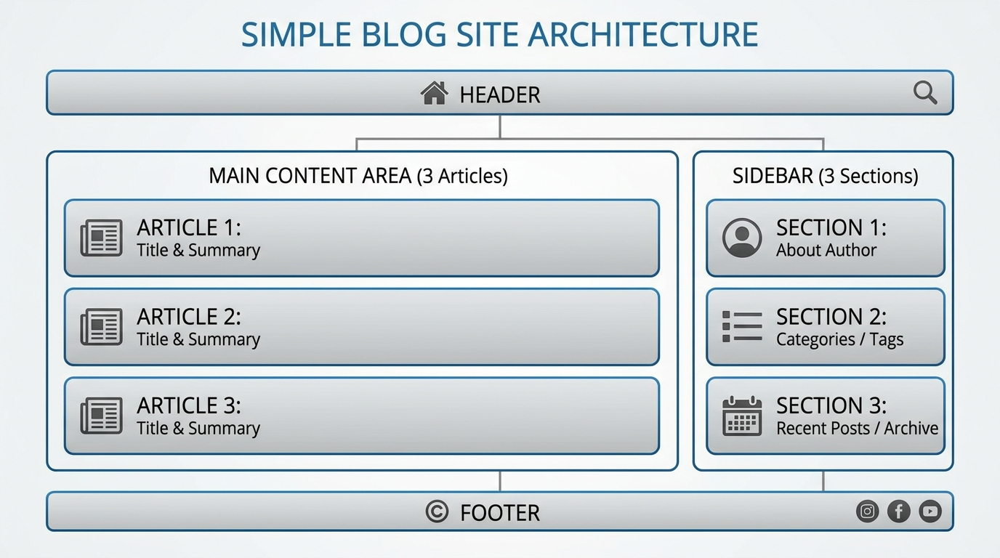

# Blog Architecture

This document describes the structure of the simple blog site.

## Architecture Diagram

## Component Breakdown

1.  **Header**: Contains the site title and navigation links.
2.  **Main Content Area**: Displays the blog posts in a list format.
3.  **Sidebar**: Houses additional information like "About" and "Recent Posts".
4.  **Footer**: Contains copyright information.
